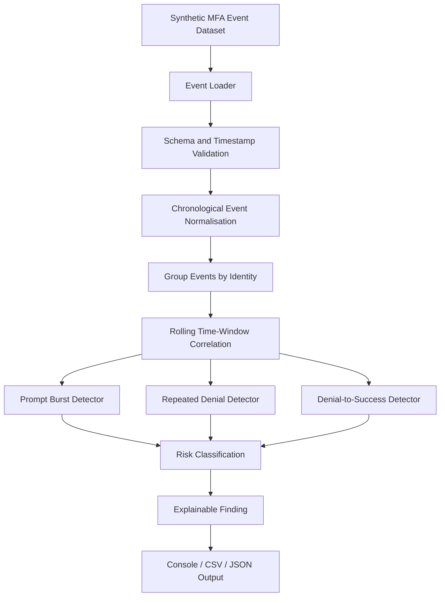

# SMFAA — Sunhaven MFA Fatigue Attack Analyzer

## Project Summary

**SMFAA — Sunhaven MFA Fatigue Attack Analyzer** is a standalone, read-only cybersecurity analysis prototype developed as an individual technical component for the fictional **Sunhaven Care Workforce IAM** capstone environment.

SMFAA focuses on a specific authentication-security problem: **MFA fatigue / MFA push bombing**.

The tool will analyse **synthetic MFA authentication events** and identify suspicious time-based patterns such as:

- rapid MFA prompt bursts;
- repeated MFA denials or rejections;
- repeated denials followed by a successful MFA approval;
- suspicious activity that crosses configurable detection thresholds.

SMFAA does not configure MFA, provision users, change roles, disable accounts, make contextual access decisions, or manage sessions. Its purpose is to analyse authentication-event behaviour and produce explainable findings.

---

# 1. Problem

The wider Sunhaven Care project uses MFA to strengthen authentication for a high-turnover workforce using shared devices and sensitive resident information.

MFA reduces the risk of password-only compromise, but it can be abused through repeated prompts. An attacker who already knows or has guessed a password may repeatedly trigger MFA requests in an attempt to pressure, confuse, or fatigue a user into approving one.

A single MFA denial is not enough to indicate an attack.

For example:

```text
09:00 MFA_DENIED
09:25 MFA_SUCCESS
```

may simply represent a user entering or confirming authentication incorrectly and trying again later.

A more suspicious pattern is:

```text
09:00 MFA_DENIED
09:01 MFA_DENIED
09:01 MFA_DENIED
09:02 MFA_DENIED
09:03 MFA_DENIED
09:04 MFA_SUCCESS
```

The security problem is therefore:

> **How can Sunhaven distinguish normal MFA authentication mistakes from suspicious MFA-fatigue behaviour by analysing the timing, frequency, order and outcome of MFA events?**

---

# 2. Proposed Solution

SMFAA will provide a separate analysis layer over synthetic MFA event data.

The planned workflow is:

```text
Synthetic MFA Events
        ↓
Input Validation
        ↓
Chronological Normalisation
        ↓
Grouping by Identity
        ↓
Rolling Time-Window Correlation
        ↓
Pattern Detection
        ↓
Risk Classification
        ↓
Explainable Finding
        ↓
Console / CSV / JSON Output
```

SMFAA will initially detect three main types of suspicious behaviour:

1. **Prompt Burst**  
   An unusually high number of MFA prompts within a short time window.

2. **Repeated Denial Pattern**  
   Multiple MFA requests rejected by the same user within a configured period.

3. **Denial-to-Success Pattern**  
   Multiple rejected MFA requests followed by a successful approval within the same or related detection window.

The tool will remain read-only. It will report findings for review but will not automatically block a user, revoke a session, change MFA, or modify Microsoft Entra ID.

---

# 3. Why SMFAA Fits the Sunhaven Project

The wider Sunhaven project already uses MFA as part of its authentication-security design.

SMFAA extends that area without duplicating MFA configuration.

```text
Core Sunhaven IAM
        ↓
MFA is configured and used
        ↓
Authentication events are produced
        ↓
SMFAA analyses event patterns
        ↓
Suspicious MFA-fatigue finding
```

This supports the wider project goals of:

- stronger authentication;
- protection of workforce identities;
- security monitoring;
- safer use of shared devices;
- explainable security evidence;
- protection of sensitive resident information.

SMFAA therefore aligns with the existing IAM project while remaining technically independent.

---

# 4. Individual Technical Boundary

## SMFAA does

- analyse synthetic MFA event sequences;
- validate timestamps and event fields;
- group events by user;
- correlate events using configurable time windows;
- detect prompt bursts;
- detect repeated MFA denials;
- detect denial-to-success sequences;
- apply severity;
- generate explainable findings;
- support automated tests.

## SMFAA does not

- configure MFA;
- configure Conditional Access;
- create or disable users;
- perform JML;
- assign or remove roles;
- perform RBAC enforcement;
- remediate access reviews;
- make device or network-location access decisions;
- manage authenticated sessions;
- build the Flask/Jinja2 interface;
- perform attack-path simulation;
- automatically respond to a suspected attack.

---

# 5. Initial Architecture



**Figure 1. Initial SMFAA MFA Event Correlation and Detection Workflow**

---

# 6. Initial Planned Scenarios

| ID | Scenario | Expected result |
|---|---|---|
| SMFAA-S01 | Normal MFA approval | PASS |
| SMFAA-S02 | One or two isolated denials | No fatigue finding |
| SMFAA-S03 | Repeated denials inside a short window | Suspicious finding |
| SMFAA-S04 | Repeated denials followed by success | High-severity finding |
| SMFAA-S05 | Rapid repeated MFA prompts | Prompt-burst finding |
| SMFAA-S06 | Just below vs exactly at threshold | Boundary behaviour |
| SMFAA-S07 | Suspicious sequence on privileged fictional identity | Elevated severity |
| SMFAA-S08 | Invalid/malformed event data | Validation failure |

---

# 7. Planned Development Stages

## Stage 1 — Planning and Scope

- project definition;
- problem statement;
- proposed solution;
- scope boundary;
- project alignment;
- initial requirements;
- initial architecture.

## Stage 2 — Event and Rule Design

- define event schema;
- define supported MFA event types;
- define threshold configuration;
- define time windows;
- create initial synthetic scenario datasets.

## Stage 3 — Core Processing

- event loading;
- schema validation;
- timestamp validation;
- chronological ordering;
- grouping by user;
- rolling-window correlation.

## Stage 4 — Detection Logic

- prompt-burst detector;
- repeated-denial detector;
- denial-to-success detector;
- severity classification;
- finding generation.

## Stage 5 — Testing

- normal cases;
- suspicious cases;
- boundary-value tests;
- malformed-input tests;
- regression tests.

## Stage 6 — Reporting and Evidence

- console output;
- CSV/JSON output;
- screenshots;
- pytest evidence;
- requirement traceability;
- final demonstration preparation.

---

# 8. Current Status

```text
Topic selection: Complete
Project alignment review: Complete
Initial planning documents: In progress
Architecture: Initial version
Event schema: Not yet implemented
Python prototype: Not started
Automated tests: Not started
Generated evidence: Not started
```

No detection result is currently claimed as implemented or tested.

---

# 9. Safety and Academic Integrity

The project will use:

- fictional users only;
- synthetic MFA events;
- no real MFA codes;
- no passwords;
- no access tokens;
- no production tenant secrets;
- no real resident information.

SMFAA is an educational cybersecurity prototype and is not a production SOC, SIEM, Microsoft Entra ID Protection replacement, or formal compliance solution.
