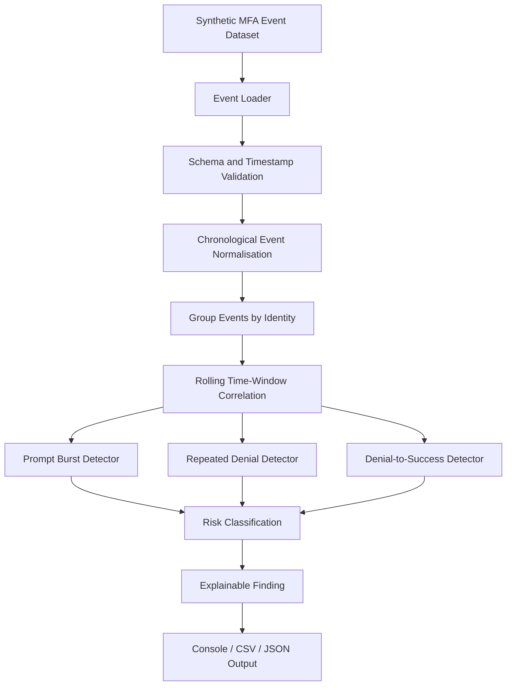

# SMFAA Project Plan

## 1. Project Title

**SMFAA — Sunhaven MFA Fatigue Attack Analyzer**

---

## 2. Background

Sunhaven Care is the fictional aged-care organisation used in the AC-2 Workforce Identity and Access Governance capstone project.

The wider project is designed around a high-turnover workforce, casual and agency staff, shared-device usage, sensitive resident information and the need for stronger identity governance.

The team solution includes Microsoft Entra ID, MFA, RBAC, JML processes, access review, audit evidence and additional security controls.

MFA is therefore already an important part of the Sunhaven authentication model.

SMFAA adds a separate security-analysis capability focused on **how MFA events behave over time** rather than how MFA is configured.

---

## 3. Problem Definition

MFA is an effective additional authentication control, but an attacker may abuse the MFA process itself.

An MFA-fatigue or push-bombing pattern can occur when an attacker repeatedly triggers MFA requests after obtaining or guessing a user's primary credential.

The user may:

- deny several requests;
- ignore repeated prompts;
- become confused about whether the requests are legitimate;
- eventually approve one simply to stop the repeated notifications.

This produces a security problem that cannot be identified reliably by looking at a single authentication event.

### Example — ordinary authentication behaviour

```text
09:10 MFA_DENIED
09:35 MFA_SUCCESS
```

This may be a normal mistake.

### Example — suspicious behaviour

```text
09:10 MFA_DENIED
09:11 MFA_DENIED
09:11 MFA_DENIED
09:12 MFA_DENIED
09:13 MFA_DENIED
09:14 MFA_SUCCESS
```

The second example is more suspicious because of:

- event frequency;
- short time interval;
- repeated rejection;
- later successful approval.

### Core Problem Statement

> **Sunhaven needs a way to analyse MFA events as correlated time-based sequences so suspicious MFA-fatigue behaviour can be distinguished from ordinary authentication errors.**

---

## 4. Proposed Solution

SMFAA will be a standalone Python-based analysis prototype.

It will process synthetic MFA events using a deterministic pipeline.

### Planned Processing Flow

```text
Synthetic MFA Event Data
        ↓
Schema Validation
        ↓
Timestamp Validation
        ↓
Chronological Ordering
        ↓
Identity-Based Grouping
        ↓
Rolling Time-Window Correlation
        ↓
Pattern Detection
        ↓
Risk Classification
        ↓
Explainable Finding
        ↓
Structured Report
```

### Initial Detectors

#### 4.1 Prompt Burst Detector

Detects multiple MFA challenge/prompt events occurring inside a configured time window.

#### 4.2 Repeated Denial Detector

Detects repeated rejected MFA requests for the same identity within a short period.

#### 4.3 Denial-to-Success Detector

Detects a sequence where repeated rejections are followed by a successful MFA approval.

This detector is particularly important because a success immediately after repeated denials may be more suspicious than repeated denials alone.

---

## 5. Main Project Objective

> **To develop a standalone, read-only cybersecurity-analysis prototype that reconstructs synthetic MFA authentication events into time-based sequences and identifies suspicious MFA-fatigue patterns without duplicating the Sunhaven project's existing MFA configuration, IAM lifecycle, access-control, session-security or presentation components.**

---

## 6. Specific Objectives

SMFAA will aim to:

1. create a consistent synthetic MFA event model;
2. validate event records before analysis;
3. normalise and order event timestamps;
4. group events by fictional identity;
5. correlate events using rolling time windows;
6. detect suspicious prompt bursts;
7. detect repeated MFA denials;
8. detect denial-to-success sequences;
9. reduce obvious false positives by including benign baseline cases;
10. assign transparent severity levels;
11. show exactly which events caused a finding;
12. support repeatable automated testing;
13. generate structured results in later development stages.

---

## 7. How SMFAA Aligns with the Sunhaven Project

The wider project requires MFA and secure authentication for Sunhaven workforce users.

SMFAA does not replace that implementation.

Instead:

```text
Sunhaven IAM:
MFA protects authentication.

SMFAA:
Analyses whether MFA events show suspicious abuse of that control.
```

The component contributes to the project's broader goals by supporting:

### Strong Authentication

MFA is already part of the project's authentication model. SMFAA analyses suspicious use of the MFA process.

### Protection of Sensitive Information

A compromised workforce identity could provide access to sensitive resident information. Detecting suspicious MFA activity supports the overall protection objective.

### Security Monitoring and Evidence

SMFAA produces clear, repeatable findings from synthetic authentication events.

### Shared-Device Environment

Although SMFAA does not manage sessions or devices, stronger detection around authentication is relevant to an environment where many users access services from shared workstations.

### Cybersecurity Depth

The project requires more than simple event counting. SMFAA introduces:

- temporal event correlation;
- rolling windows;
- sequence reconstruction;
- threshold logic;
- boundary-value testing;
- explainable detection rules;
- deterministic automated tests.

---

## 8. How SMFAA Is Different from Team Members

### Rifat — Core IAM and Security

Rifat's core work covers operational IAM areas including MFA, RBAC, JML, access review, policy controls and Entra-related implementation.

SMFAA does not configure or enforce those controls.

```text
Rifat:
Configure and operate MFA.

SMFAA:
Analyse event sequences produced by MFA authentication.
```

### Prothom — Web Presentation

Prothom focuses on the Flask/Jinja2 web layer, including audit presentation, protected pages, 403 handling, logout and other presentation behaviour.

SMFAA does not create a web application or audit dashboard.

### Adnan — CAPE

CAPE evaluates access requests using resource sensitivity, device status and network location.

SMFAA does not make contextual access decisions.

### Adnan — SSSA

SSSA focuses on whether a shared-device session remains safe after authentication.

SMFAA focuses on the MFA authentication sequence itself.

### Previous SITAS Work

SITAS models attack paths and control effects.

SMFAA does not simulate attack paths. It evaluates concrete synthetic authentication-event sequences.

---

## 9. Scope

### In Scope

- synthetic MFA event datasets;
- timestamp validation;
- event ordering;
- identity grouping;
- rolling-window analysis;
- prompt-burst detection;
- repeated-denial detection;
- denial-to-success detection;
- configurable thresholds;
- transparent severity;
- explainable findings;
- automated testing;
- later CSV/JSON reporting.

### Out of Scope

- MFA configuration;
- Conditional Access;
- account provisioning;
- account disablement;
- JML;
- RBAC enforcement;
- role/group remediation;
- access-review remediation;
- password-spray detection in the initial version;
- device trust;
- network-location analysis;
- session-timeout control;
- Flask/Jinja2 dashboards;
- attack-path simulation;
- automatic incident response.

---

## 10. Initial System Architecture



**Figure 1. Initial SMFAA MFA Event Correlation and Detection Workflow**

---

## 11. Initial Security Scenarios

| Scenario | Description | Expected result |
|---|---|---|
| SMFAA-S01 | Normal MFA challenge and approval | PASS |
| SMFAA-S02 | One/two ordinary denials | No fatigue finding |
| SMFAA-S03 | Repeated denials within configured window | Suspicious finding |
| SMFAA-S04 | Repeated denials followed by success | High-severity finding |
| SMFAA-S05 | Rapid prompt burst | Prompt-burst finding |
| SMFAA-S06 | Just below vs at threshold | Correct boundary behaviour |
| SMFAA-S07 | Suspicious sequence affecting privileged test identity | Elevated severity |
| SMFAA-S08 | Invalid timestamp/missing field | Controlled validation failure |

---

## 12. Development Plan

### Phase 1 — Planning and Requirements

Deliverables:

- README;
- project plan;
- scope boundary;
- initial requirements;
- policy/project alignment;
- initial architecture.

### Phase 2 — Data Model and Detection Rules

Deliverables:

- event schema;
- event-type vocabulary;
- threshold configuration;
- correlation-window configuration;
- synthetic scenario datasets.

### Phase 3 — Core Processing

Deliverables:

- event loader;
- schema validator;
- timestamp normaliser;
- identity grouping;
- rolling-window engine.

### Phase 4 — Detection Components

Deliverables:

- prompt-burst detector;
- repeated-denial detector;
- denial-to-success detector;
- severity classifier;
- finding generator.

### Phase 5 — Testing

Deliverables:

- unit tests;
- clean baseline tests;
- suspicious-pattern tests;
- boundary tests;
- malformed-input tests;
- regression tests.

### Phase 6 — Reporting and Evidence

Deliverables:

- console report;
- CSV/JSON output;
- pytest results;
- screenshots;
- evidence pack;
- requirements traceability;
- demonstration material.

---

## 13. Planned Deliverables

| Deliverable | Purpose | Current state |
|---|---|---|
| Project Plan | Define problem and proposed solution | Initial |
| Scope Boundary | Prevent overlap | Initial |
| Requirements | Define expected behaviour | Initial |
| Policy Alignment | Show relation to Sunhaven authentication security | Initial |
| Architecture | Define logical processing flow | Initial |
| Event Schema | Define MFA event structure | Not started |
| Detection Rules | Define thresholds/windows | Not started |
| Python Prototype | Implement correlation/detection | Not started |
| Automated Tests | Verify behaviour | Not started |
| Reports | Present findings | Not started |
| Evidence Pack | Support progress/final assessment | Not started |

---

## 14. Success Criteria

SMFAA will be considered technically successful when:

- valid synthetic event data loads correctly;
- invalid records fail safely;
- events are analysed chronologically;
- events are correctly grouped by identity;
- normal low-volume behaviour does not trigger a fatigue finding;
- configured prompt bursts are detected;
- configured denial bursts are detected;
- repeated denial followed by success is detected;
- boundary values behave exactly as defined;
- findings show the events that triggered them;
- the same input produces repeatable results;
- the tool does not modify an IAM environment.

---

## 15. Current Project Status

```text
Topic selected: Yes
Problem defined: Yes
Proposed solution defined: Yes
Project alignment documented: Yes
Initial architecture: Yes
Event schema: No
Detection configuration: No
Code: No
Tests: No
Results: No
```

This baseline is intentionally conservative so later technical progress can be demonstrated honestly.
